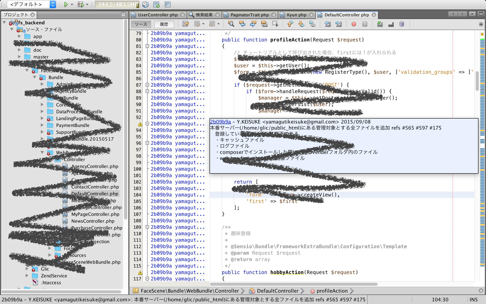
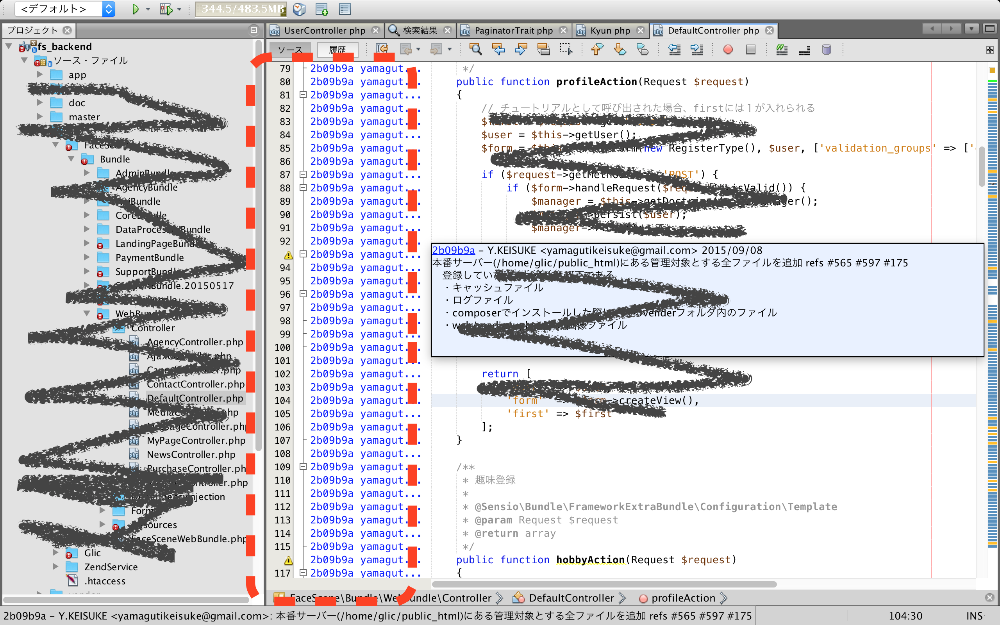
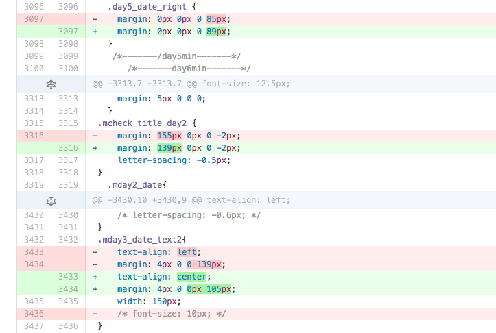
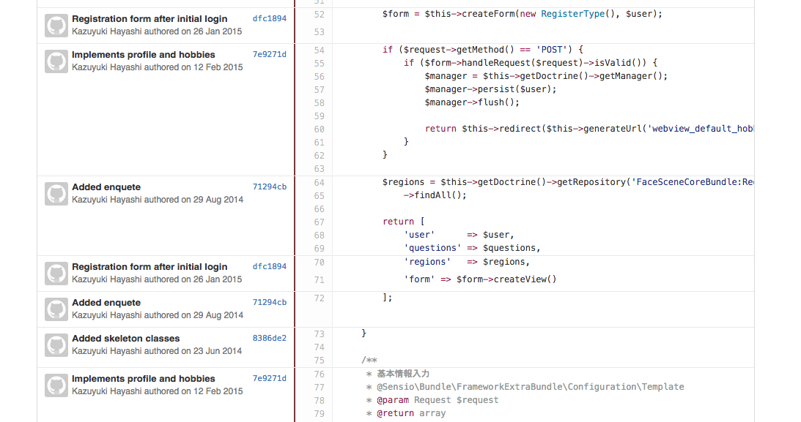
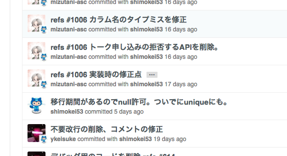

# gitで失われた歴史を取り戻した話

---


* @shimokei53
    * http://qiita.com/smd8122
    * tw:smdhogehoge
* 流浪の引きこもりエンジニア
* PHP2年半→Ruby1年半→PHP3か月←イマココ
* Symfony歴も3か月
* 趣味はgit blame

--

* ascreed, Inc.
    * http://ascreed.jp/about_ascreed.pdf
    * tihousousei
* 好きにやらせてもらってます
* 経営メンバーがとにかくすごい
* 開発力が足りない！

--
# NOW HIRING!
* お気軽にお声掛けください
* 条件などなど今ならオイシイお話できると思います

---

# 人生初LTです
## お手柔らかにお願いいたします

---

# 本題

---

# gitの履歴を取り戻したい話

---

## 何が起こっていたか?

---

## 何が起こっていたか?

--

## 何が起こっていたか?

--

## ほぼ全ての行の履歴が同じコミットを指していた

--

# blameしても辿れない

---
# 経緯
--
## 創生期
* 開発開始~途中まではgit管理下にあった
--
## 混乱期
* ある時期から、本番反映がFTPデプロイになった
    * git,バージョン管理の概念がない現場へ開発が移動
    * リポジトリの内容と本番運用のコードに乖離が生じていた
--
## Xデー
* git運用に戻すべく、本番環境のコードをcommit
    * リポジトリ内部の全ファイル削除 (commit A
    * 本番環境のコードを全ファイル追加 (commit B
--
## 安定期
* 1ヶ月ほど経過
--
* ここで@shimokei53ジョイン

---

# その結果

--

# git blameで辿れない
* ほぼ全ての行のcommit履歴がXデーの commit Bのものになっていた
--

## 仕様書等のドキュメントもないため「実装が仕様」状態
* 文脈がわからない
* この行なんでここでこうしてるの？
--

## 創生期の時点ではかなりSymfony力高め
* なので余計に設計とか追いかけたくなった

---

# 作戦

--

* 現行のdevelopから新規に置き換える予定のdevelop_mirrorを切る

--

* 全ファイル削除&全ファイル追加を行ったコミットをsquash
    * 同一のコミットで同名のファイルをrm & git addすると同じファイルとみなされる挙動に期待
--

* それ以降のコミットを全てrebase
    * 673 commit!
    * こわい
--

* できたdevelop_mirrorをdevelopへ,現行のdevelopをdevelop_oldへrename
---

# 弊害

## 当然developが超conflictします
--
* 開発メンバー全員への告知、同意は必須
* むしろ被害を受けるメンバーが少ないうちにやるべきだ、と自分に言い聞かせる

--
## 進行中のPull Requestは立て直す必要あり
* リクエスト先が変わるため
* ある程度片付けてからの方がよい

--
## develop->masterもconflictする
* 本当はmasterから先にやらないといけない
  * こわい

---

# やってみた

--

### 最初の壁

# rebase中にconflictしまくる

--

* 混乱期にコメントアウトでバージョン管理してたところが衝突しまくる
* 慎重に手作業でひとつひとつ解消
* 673commit中,30回ほどの衝突で済んだ（多い？）

--

### 第2の壁

# マージコミットが消えた

--

```
$ git rebase -p
```

* `-p` オプション付けないとrebase時にマージコミットが飛ばされます
* 全て終わった後に気づき泣く泣くやり直し

---

# 結果

--

## 全削除&&全追加コミットをsquash
# →おおむね成功！

--

元々「全行追加」だったコミットをみると<br>
いい感じに差分が現れている

--

## 肝心のgit blameは…
# →大成功！

--

history画面がすごく饒舌


--

## 乗せ直したコミットはどうなっている?

--



--

???

--
## メインブランチの入れ替えは…
# →・・・

--

# まだ実行できず
orz
---

## わかったこと

--

## 諦めない心
* そもそも初期にgit管理下にあったからこそ歴史を繋げることができた

--
## gitすごい
* 「rm & git add」が予想以上に上手く作用する

--
## 週末に危ないことしない
* LTネタのためにみんなに迷惑かけちゃだめ

---

## gitの歴史を~~取り戻した話~~

--

## gitの歴史を ~~取り戻した話~~
# gitの歴史を取り戻したかったけどLTには間に合わなかった話

---
# お粗末さまでした
ご静聴ありがとうございました
